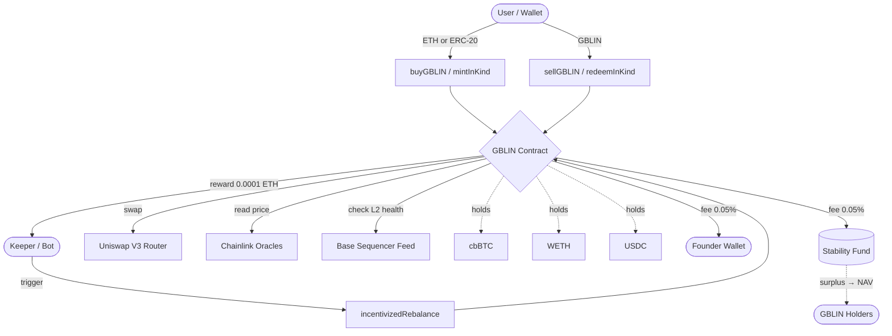

# GBLIN V5 — Technical Specification

[](https://opensource.org/licenses/MIT)
[](https://basescan.org/)
[](https://soliditylang.org/)
[](https://github.com/gblinproject/Whitepaper)
[](#audit-status)

> **Global Balanced Liquidity Index** — A fully collateralized, autonomously rebalanced, on-chain index of digital assets, deployed on Base Mainnet.

---

## Abstract

GBLIN is a non-custodial ERC-20 index token whose price is deterministically derived from a basket of underlying assets (cbBTC, WETH, USDC) held by the contract itself. Unlike algorithmic stablecoins or AMM-priced tokens, GBLIN's value is computed on-chain from oracle-verified Net Asset Value (NAV) at every interaction. The protocol introduces three innovations over traditional on-chain index funds:

1. **Crash Shield** — an automatic, oracle-driven mechanism that reduces exposure to any basket asset undergoing a drawdown greater than 20% from its recent peak, redistributing weight to healthy stable assets.
2. **Permissionless rebalancing** — any address can trigger a rebalance and earn a fixed reward (0.0001 ETH) from the protocol's stability fund, eliminating reliance on a centralized keeper.
3. **In-Kind facility** — institutional-grade mint/redeem flows that bypass swap slippage by depositing/receiving the basket assets directly, mirroring the authorized-participant mechanism of traditional ETFs.

This document specifies the contract's mathematical model, function-level behavior, security assumptions, and historical case studies demonstrating capital protection during real market events.

---

## Deployment

| Field | Value |
|---|---|
| **Contract address** | [`0x38DcDB3A381677239BBc652aed9811F2f8496345`](https://basescan.org/address/0x38DcDB3A381677239BBc652aed9811F2f8496345) |
| **Network** | Base Mainnet (chain ID 8453) |
| **Version** | V5 |
| **Compiler** | Solidity ^0.8.20 |
| **Optimizer** | Enabled (200 runs) |
| **License** | MIT |
| **DEX integration** | Uniswap V3 (Base) |
| **Oracles** | Chainlink price feeds + Base sequencer feed |

### Useful links

- Website: [gblin.digital](https://gblin.digital)
- Whitepaper: [GBLIN_WHITE_PAPER_V5.pdf](https://github.com/gblinproject/Whitepaper/raw/main/GBLIN_WHITE_PAPER_V5.pdf)
- Dune Analytics: [dune.com/gblin/dashboard](https://dune.com/gblin/dashboard)
- Aerodrome V5 pool: [`0x7dcd...ae1b`](https://aerodrome.finance/)
- X / Twitter: [@GBLIN_Protocol](https://x.com/GBLIN_Protocol)
- Farcaster: [@gblin](https://warpcast.com/gblin)
- Email: info@gblin.digital

---

## Table of Contents

1. [Protocol Architecture](#1-protocol-architecture)
2. [Token Architecture](#2-token-architecture)
3. [The Basket: Composition and Weights](#3-the-basket-composition-and-weights)
4. [NAV (Net Asset Value) Calculation](#4-nav-net-asset-value-calculation)
5. [Fee System and Redistribution](#5-fee-system-and-redistribution)
6. [Autonomous Rebalance Mechanism](#6-autonomous-rebalance-mechanism)
7. [The Crash Shield: Mathematics of Protection](#7-the-crash-shield-mathematics-of-protection)
8. [Historical Case Studies](#8-historical-case-studies)
9. [In-Kind Facility (ETF-style Mint/Redeem)](#9-in-kind-facility-etf-style-mintredeem)
10. [Complete Function Reference](#10-complete-function-reference)
11. [Security and Defenses](#11-security-and-defenses)
12. [Audit Status](#12-audit-status)
13. [Bug Bounty & Responsible Disclosure](#13-bug-bounty--responsible-disclosure)
14. [Repository Structure](#14-repository-structure)
15. [Contributing](#15-contributing)
16. [References & Further Reading](#16-references--further-reading)
17. [Technical Glossary](#17-technical-glossary)

---

## 1. Protocol Architecture



The contract is the only custodian of basket assets. Every read (NAV, quotes) and every write (mint, burn, rebalance) is fully self-contained. There are no external admin keys able to move user funds, and ownership can be permanently renounced.

---

## 2. Token Architecture

GBLIN inherits from OpenZeppelin's `ERC20`, `ERC20Permit`, and `ReentrancyGuard`.

```solidity
contract GBLIN_GlobalBalancedLiquidityIndex is ERC20, ERC20Permit, ReentrancyGuard
```

### Main characteristics

| Property | Value |
|---|---|
| Name | Global Balanced Liquidity Index |
| Symbol | GBLIN |
| Decimals | 18 |
| Initial supply | 0 (uncapped, mintable on deposit) |
| ERC20Permit | Yes (EIP-2612 signatures supported) |
| Reentrancy Guard | Yes on all stateful external functions |

### Core state variables

```solidity
Asset[] public basket;             // Asset basket
uint256 public stabilityFund;      // Stability reserve in WETH
uint256 public maxInternalSlippage = 200;   // 2% maximum slippage
uint256 public reserveFloor = 0.05 ether;
uint256 public reserveCeiling = 2 ether;
```

### Immutable constants

```solidity
FOUNDER_FEE_BPS    = 5      // 0.05% to creator
STABILITY_FEE_BPS  = 5      // 0.05% to stability fund
BPS_DENOMINATOR    = 10000
MIN_DEPOSIT        = 0.0005 ether
ORACLE_TIMEOUT     = 86400  // 24 hours
TIMELOCK_DURATION  = 48 hours
CRASH_THRESHOLD_BPS = 2000  // 20% drawdown triggers crash shield
SLASH_MULTIPLIER   = 2000   // reduction to 20% of base weight
PEAK_DECAY_PER_DAY = 50     // 0.5% decay per day
YIELD_INTERVAL     = 7 days
```

---

## 3. The Basket: Composition and Weights

At deployment, the basket is initialized as follows:

| Index | Asset | Base Weight | Pool Fee | Stable | Chainlink Oracle |
|---|---|---|---|---|---|
| 0 | **cbBTC** | 45.00% | 0.05% | No | `0x07DA0E54...59f9D` |
| 1 | **WETH** | 45.00% | — | No | `0x71041ddd...6Bb70` |
| 2 | **USDC** | 10.00% | 0.05% | Yes | `0x7e860098...2bc6B` |

### `Asset` struct

```solidity
struct Asset {
    address token;          // Token address
    address oracle;         // Chainlink price feed
    uint24  poolFee;        // Uniswap V3 fee tier
    bool    isStable;       // Is it a stablecoin?
    uint256 baseWeight;     // Permanent target weight (BPS)
    uint256 dynamicWeight;  // Effective current weight (BPS)
    uint256 peakPrice;      // Recent maximum price (for crash shield)
    uint256 lastPeakUpdate; // Last peak update timestamp
}
```

**Crucial distinction:**
- `baseWeight` = desired weight under normal conditions
- `dynamicWeight` = effective weight after Crash Shield and redistribution

---

## 4. NAV (Net Asset Value) Calculation

The NAV is the mathematical core of GBLIN. It answers: *"How much is one GBLIN worth in ETH?"*

### Formula

$$
\text{NAV} = \frac{\sum_{i=1}^{n} \text{balance}_i \cdot \text{price}_i^{\text{ETH}} - \text{stabilityFund}}{\text{totalSupply} - \text{contractBalance}}
$$

Where:
- $\text{balance}_i$ = on-chain balance of asset $i$
- $\text{price}_i^{\text{ETH}}$ = Chainlink-derived price of asset $i$ in ETH
- $\text{stabilityFund}$ = WETH reserve excluded from NAV
- $\text{contractBalance}$ = GBLIN held by the contract itself (excluded from circulating supply)

### On-chain implementation

```solidity
function _calculateNAV(uint256 excludeWeth) internal view returns (uint256) {
    uint256 supply = totalSupply() - balanceOf(address(this));
    if (supply == 0) return 1 ether;
    return (_calculateTotalEthValue(excludeWeth) * 1 ether) / supply;
}
```

### Total value calculation

```solidity
function _calculateTotalEthValue(uint256 excludeWeth) internal view returns (uint256) {
    uint256 wethBal = IWETH(WETH).balanceOf(address(this));
    wethBal = wethBal > excludeWeth ? wethBal - excludeWeth : 0;
    uint256 totalEthVal = wethBal > stabilityFund ? wethBal - stabilityFund : 0;

    for (uint i = 0; i < basket.length; i++) {
        if (basket[i].token != WETH && basket[i].dynamicWeight > 0) {
            uint256 bal = IERC20(basket[i].token).balanceOf(address(this));
            if (bal > 0) totalEthVal += _convertToEth(basket[i], bal);
        }
    }
    return totalEthVal;
}
```

### Numerical example

Assume:
- Contract WETH balance: **3 ETH**
- cbBTC balance: **0.005 cbBTC** (≈ 3 ETH at current price)
- USDC balance: **2,500 USDC** (≈ 0.7 ETH)
- Stability Fund: **0.05 ETH**
- Total supply: **5 GBLIN**

$$
\text{TVL} = (3 - 0.05) + 3 + 0.7 = 6.65 \text{ ETH}
$$
$$
\text{NAV} = \frac{6.65}{5} = 1.33 \text{ ETH per GBLIN}
$$

### Cross-asset conversion (Chainlink-based)

```solidity
function _convertToEth(Asset memory _a, uint256 _amt) internal view returns (uint256) {
    uint256 pE = _getOraclePrice(WETH_ORACLE);
    uint256 pA = _getOraclePrice(_a.oracle);
    uint256 val = (_amt * pA) / pE;
    uint8 d = IERC20Metadata(_a.token).decimals();
    return d < 18 ? val * (10**(18-d)) : val / (10**(d-18));
}
```

Decimal adjustment is critical: cbBTC has 8 decimals, USDC has 6. Normalization to 18 ensures consistency with WETH.

---

## 5. Fee System and Redistribution

### The two fees

Every GBLIN purchase pays **0.10%** total, split into:

| Fee | Value | Destination |
|---|---|---|
| `FOUNDER_FEE_BPS` | 5 BPS (0.05%) | Creator wallet |
| `STABILITY_FEE_BPS` | 5 BPS (0.05%) | Stability Fund (WETH held by contract) |

```solidity
fF = (ethAmt * FOUNDER_FEE_BPS) / BPS_DENOMINATOR;
sF = (ethAmt * STABILITY_FEE_BPS) / BPS_DENOMINATOR;
```

### The Stability Fund

The `stabilityFund` is a WETH reserve held by the contract, **excluded from NAV calculation**. Its purposes:

1. Pay rewards to keepers executing rebalances (0.0001 ETH/call)
2. Cover shortfalls in case of slippage during internal swaps
3. Provide a minimum liquidity reserve

### Dynamic Reserve and Surplus Distribution

The "appropriate" reserve amount is calculated dynamically:

$$
\text{reserve} = \text{clip}\left(\frac{\text{TVL}}{1000},\ \text{floor},\ \text{ceiling}\right)
$$

```solidity
function getDynamicReserve() public view returns (uint256) {
    uint256 dynamicReserve = _calculateTotalEthValue(0) / 1000;  // 0.1% of TVL
    if (dynamicReserve < reserveFloor) return reserveFloor;       // never below 0.05 ETH
    if (dynamicReserve > reserveCeiling) return reserveCeiling;   // never above 2 ETH
    return dynamicReserve;
}
```

### The cornerstone function: `distributeYield()`

When the reserve exceeds the dynamic target, the **surplus implicitly re-enters the NAV** (because excess WETH is no longer excluded):

```solidity
function distributeYield() external {
    if (block.timestamp < lastYieldDistribution + YIELD_INTERVAL) revert TimeNotPassed();
    uint256 currentReserve = getDynamicReserve();
    if (stabilityFund <= currentReserve) revert NoExcessYield();

    uint256 excess = stabilityFund - currentReserve;
    stabilityFund = currentReserve;
    lastYieldDistribution = block.timestamp;
    emit YieldDistributed(excess);
}
```

### What this means for holders

The excess accumulated above `getDynamicReserve()` is not distributed as a dividend but **incorporated into the NAV**: every 7 days the value of each GBLIN increases proportionally to the trading volume of the period.

**Real example:**

- Basket TVL: 50 ETH → target reserve = 0.05 ETH
- Accumulated Stability Fund: 0.18 ETH
- Distributed surplus: 0.13 ETH
- Supply: 100 GBLIN
- NAV effect: **+0.0013 ETH per GBLIN** (≈ +0.1% market value in one week, derived purely from volume)

This mechanism is automatically triggered (`_autoDistributeYield()`) on every `buy`/`sell`, and can be manually called by anyone.

---

## 6. Autonomous Rebalance Mechanism

### Objective

Maintain the **ETH value of each asset** aligned with the target weight (`dynamicWeight`).

### Mathematical target

For each asset $i$:

$$
\text{TargetValue}_i = \text{TVL} \cdot \frac{\text{dynamicWeight}_i}{10000}
$$

If $\text{currentValue}_i < \text{TargetValue}_i$ → buy. Else → sell.

### Implementation: `incentivizedRebalance()`

```solidity
function incentivizedRebalance(uint256 assetIndex, bool isWethToAsset, uint256 amountToSwap) external nonReentrant
```

**Step-by-step flow:**

1. **Minimum volume check** — prevents fund drain attacks:

   ```solidity
   uint256 minSwapRequired = IWETH(WETH).balanceOf(address(this)) / 100;
   if (minSwapRequired < 0.01 ether) minSwapRequired = 0.01 ether;
   ```

2. **Weight refresh** — applies Crash Shield and redistribution in real time.

3. **Target calculation**:

   ```solidity
   uint256 targetAssetEthValue = (_calculateTotalEthValue(0) * a.dynamicWeight) / BPS_DENOMINATOR;
   uint256 currentAssetEthValue = _convertToEth(a, IERC20(a.token).balanceOf(address(this)));
   ```

4. **Direction and trade capping**:
   - If `isWethToAsset = true`: swap allowed only if `currentAssetEthValue < targetAssetEthValue`. Amount capped to required delta.
   - If `isWethToAsset = false`: swap allowed only if `currentAssetEthValue > targetAssetEthValue`.

5. **Uniswap V3 swap execution** with `minOut` calculated applying `maxInternalSlippage` (default 2%).

6. **Keeper reward**:

   ```solidity
   if (stabilityFund >= 0.0001 ether) {
       stabilityFund -= 0.0001 ether;
       IWETH(WETH).withdraw(0.0001 ether);
       (bool success, ) = payable(msg.sender).call{value: 0.0001 ether}("");
   }
   ```

### Numerical rebalance example

**State:**
- TVL: 10 ETH
- Effective cbBTC: 4.0 ETH (40%)
- Effective WETH: 5.0 ETH
- Effective USDC: 1.0 ETH (10%)
- `dynamicWeight` cbBTC = 4500 BPS → target = 4.5 ETH

**Calculation:**

$$
\Delta = 4.5 - 4.0 = 0.5 \text{ ETH}
$$

A keeper calls `incentivizedRebalance(0, true, 0.5 ether)`. The contract buys 0.5 ETH of cbBTC with minimum slippage, restoring target allocation. The keeper earns 0.0001 ETH.

---

## 7. The Crash Shield: Mathematics of Protection

This is the mechanism that distinguishes GBLIN from simple peer-to-peer indexes.

### Logic

For each asset, the contract tracks the **recent price peak** (`peakPrice`). If current price drops 20% or more from the peak, the **dynamic weight is cut to 20% of baseWeight**:

$$
\text{drawdown} = \frac{\text{peakPrice} - \text{currentPrice}}{\text{peakPrice}}
$$

$$
\text{if drawdown} > 20\% \implies \text{dynamicWeight} = \text{baseWeight} \cdot 0.2
$$

```solidity
uint256 drawdown = ((peakPrice - currentPrice) * BPS_DENOMINATOR) / peakPrice;

if (drawdown > CRASH_THRESHOLD_BPS) {
    uint256 newWeight = (a.baseWeight * SLASH_MULTIPLIER) / BPS_DENOMINATOR;
    totalSlashedWeight += (a.baseWeight - newWeight);
    a.dynamicWeight = newWeight;
    emit CrashShieldActivated(a.token, newWeight);
}
```

The "slashed" weight is **redistributed to healthy assets**:

```solidity
if (totalSlashedWeight > 0) {
    if (healthyStableCount > 0) {
        uint256 extra = totalSlashedWeight / healthyStableCount;
        for (...) basket[i].dynamicWeight += extra;
    } else if (healthyRiskCount > 0) {
        // fallback: redistribute to healthy risk assets
    }
}
```

**Redistribution priority:** first to stablecoins (USDC), then to non-WETH risk assets if no healthy stables exist.

### Peak decay

To prevent historical peaks from "trapping" an asset in permanent alert, `peakPrice` decays by **0.5% per day**:

$$
\text{peakPrice}_{t+1} = \text{peakPrice}_t \cdot (1 - 0.005 \cdot \text{daysPassed})
$$

```solidity
uint256 daysPassed = (block.timestamp - a.lastPeakUpdate) / 86400;
if (daysPassed > 0 && a.peakPrice > 0) {
    uint256 decay = (a.peakPrice * PEAK_DECAY_PER_DAY * daysPassed) / BPS_DENOMINATOR;
    a.peakPrice = (decay < a.peakPrice) ? a.peakPrice - decay : currentPrice;
}
```

If cbBTC reaches $100,000 and falls to $79,000 (-21%), the shield activates. If price stabilizes at $90,000, after ~40 days the `peakPrice` decays to ~$80,000 and the calculated drawdown returns below threshold, **automatically deactivating the shield**.

---

## 8. Historical Case Studies

### 8.1 January 2026 Crash (BTC −28%, ETH −34% in 72h)

On **January 17, 2026** the crypto market experienced a brutal correction: BTC collapsed from $108,500 to $78,000 (−28%) in three days, ETH from $4,200 to $2,770 (−34%) in the same period. The cause: cascading liquidations on perpetual exchanges following geopolitical escalation.

**Simulation: direct portfolio vs GBLIN**

Assume $10,000 invested on January 14:

**Scenario A — Direct allocation 45% BTC + 45% ETH + 10% USDC:**

| Asset | Allocation | 01/14 | 01/20 | Variation |
|---|---|---|---|---|
| BTC | $4,500 | $108,500 | $78,000 | −$1,266 |
| ETH | $4,500 | $4,200 | $2,770 | −$1,532 |
| USDC | $1,000 | $1.00 | $1.00 | $0 |
| **Total** | **$10,000** | | | **−$2,798 (−27.98%)** |

**Scenario B — Same capital in GBLIN:**

On **January 15** (day of the first −22% drop), the Crash Shield activates on BTC and ETH. Weights shift:

```
baseWeight  cbBTC  = 4500 → dynamicWeight = 900 (20%)
baseWeight  WETH   = 4500 → dynamicWeight = 900 (20%)
baseWeight  USDC   = 1000 → dynamicWeight = 1000 + (3600 + 3600) = 8200 (82%)
```

At the first post-shield rebalance, the contract **sells** part of cbBTC and WETH and **buys** USDC until basket value re-aligns.

| Asset | Post-shield allocation | 01/14 (effective) | 01/20 |
|---|---|---|---|
| cbBTC | $2,000 | $108,500 | $78,000 → $1,438 |
| WETH | $2,000 | $4,200 | $2,770 → $1,319 |
| USDC | $6,000 | $1.00 | $6,000 |
| **Total GBLIN** | $10,000 | | **$8,757 (−12.43%)** |

**Difference:** a GBLIN holder would have lost **$1,243 instead of $2,798** — savings of **55.6%** on absolute loss.

> ⚠️ The simulation assumes the rebalance is executed at the moment the shield activates. In practice, rebalance occurs when a keeper calls it or automatically on the next deposit/redemption. Actual loss depends on keeper-network reaction speed.

### 8.2 Terra/Luna Crash (May 2022)

Hypothetical case: if LUNA had been a basket asset weighted 30%, with USDC at 10%:

- May 9, 2022, 18:00 UTC: LUNA $63 → $30 (−52% in 6h).
- Recorded `peakPrice` for LUNA was ~$120 (April peak). Drawdown = (120 − 30) / 120 = **75% = 7500 BPS**.
- 7500 BPS > CRASH_THRESHOLD_BPS (2000) → Crash Shield activates immediately.
- LUNA `dynamicWeight` cut from 3000 → 600 (20%).
- The 2400 BPS recovered are redistributed to USDC.

At the next rebalance (within minutes), the contract would have **sold 80% of held LUNA at $30**, avoiding the final collapse phase (LUNA → $0.0001 within 72h).

**Mathematical result:** an initial 30% basket exposure to LUNA would have automatically reduced to 6%, with an estimated total loss of **5.4% of NAV** instead of the **30%** a passive holder would have suffered.

### 8.3 Model limitations

The Crash Shield **does not protect from:**

- **Instant crashes (>50% in few blocks)**: the shield needs a keeper to execute the rebalance.
- **Zero-liquidity events**: if the asset's Uniswap pool collapses, the swap fails with silent `try/catch` and the rebalance does not realign weights until liquidity returns.
- **Oracle de-peg**: if Chainlink returns price 0 or stale (>24h), the asset is "amputated" (weight = 0) and NAV is calculated excluding it, but losses between event and detection remain on-book.

---

## 9. In-Kind Facility (ETF-style Mint/Redeem)

A unique GBLIN feature: minting and redeeming by depositing/receiving the basket tokens directly, **without going through swaps**. Same logic used by authorized participants of traditional ETFs.

### Advantages

1. **Zero slippage**: no Uniswap swap.
2. **Zero impact** on the market price of underlying assets.
3. **Capital efficient** for those who already hold the basket.

### `quoteMintInKind(uint256 gblinTarget)`

Calculates exact amount of each asset required to mint `gblinTarget` GBLIN:

```solidity
uint256 nav = _calculateNAV(0);
uint256 totalEthNeeded = (gblinTarget * nav) / 1 ether;
for (uint i = 0; i < basket.length; i++) {
    uint256 assetEthValue = (totalEthNeeded * basket[i].dynamicWeight) / BPS_DENOMINATOR;
    requiredAssets[i] = _convertEthToAsset(basket[i], assetEthValue);
}
```

### `mintInKind(uint256 gblinTarget)`

Executes the multi-asset deposit and mints GBLIN net of the 0.10% fee.

### `redeemInKind(uint256 gblinAmount)`

Burns GBLIN and returns the proportional share of **each basket asset** to the user. No swaps, no slippage.

```solidity
(uint256 wethShare, uint256[] memory assetShares) = _getPreBurnShares(gblinAmount, supply);
_burn(msg.sender, gblinAmount);
for (uint i = 0; i < basket.length; i++) {
    if (assetShares[i] > 0) IERC20(basket[i].token).transfer(msg.sender, assetShares[i]);
}
```

---

## 10. Complete Function Reference

### 10.1 Buy functions

| Function | Description |
|---|---|
| `buyGBLIN(uint256 minGblinOut)` | Buy GBLIN by sending native ETH. `minGblinOut` protects from slippage. |
| `buyGBLINWithToken(bytes path, uint256 amountIn, uint256 minWethOut, uint256 minGblinOut)` | Buy GBLIN with any ERC-20, routing the swap via Uniswap V3 with a custom `path`. |
| `mintInKind(uint256 gblinTarget)` | Deposit the required amount of all basket assets and receive GBLIN. |

### 10.2 Sell functions

| Function | Description |
|---|---|
| `sellGBLIN(uint256 gblinAmount)` | Burns GBLIN and returns proportional basket share (receiving native tokens). |
| `sellGBLINForEth(uint256 gblinAmount, uint256 minEthOut)` | Burns GBLIN, internally swaps all assets to WETH, returns ETH. |
| `sellGBLINForToken(uint256 gblinAmount, address targetToken, uint24 wethToTargetFee, uint256 minTokenOut)` | Burns GBLIN, converts everything to WETH, then swaps to arbitrary `targetToken`. |
| `redeemInKind(uint256 gblinAmount)` | Burns GBLIN and returns each basket asset without swap. |

### 10.3 Rebalance functions

| Function | Description |
|---|---|
| `incentivizedRebalance(uint256 assetIndex, bool isWethToAsset, uint256 amountToSwap)` | Callable by anyone. Realigns asset to target weight. 0.0001 ETH reward. |
| `refreshWeights()` | Recalculates `dynamicWeight` applying Crash Shield and redistribution. Public. |

### 10.4 Yield functions

| Function | Description |
|---|---|
| `distributeYield()` | Public. Transfers Stability Fund surplus into NAV. Callable every 7 days. |
| `getDynamicReserve()` | View. Returns current target reserve in WETH. |

### 10.5 View (read-only) functions

| Function | Output |
|---|---|
| `quoteBuyGBLIN(uint256 ethAmount)` | `(gblinOut, founderFee, stabilityFee)` — buy preview. |
| `quoteSellGBLIN(uint256 gblinAmount)` | `ethOut` — full-WETH sell preview. |
| `quoteMintInKind(uint256 gblinTarget)` | Array of required assets for in-kind mint. |

### 10.6 Governance (48h timelock, owner only for add/delist and oracles)

| Function | Auth | Description |
|---|---|---|
| `proposeAsset(...)` | `onlyOwner` | Proposes a new basket asset. Executable after 48h. |
| `executeAssetAddition()` | `onlyOwner` | Adds the proposed asset (after timelock). |
| `emergencyDelist(uint256 index)` | `onlyOwner` | Sets `baseWeight = 0` for an asset (immediate exit). |
| `updateOracle(uint256 index, address newOracle)` | `onlyOwner` | Updates an asset's Chainlink oracle. |
| `updateWethOracle(address)` | `onlyOwner` | Updates WETH oracle (NAV denominator). |
| `updateMaxSlippage(uint256)` | `onlyOwner` | Modifies maximum slippage (capped at 10%). |
| `updateReserveBounds(uint256 floor, uint256 ceiling)` | `onlyOwner` | Modifies dynamic reserve bounds. |
| `updateFounderWallet(address)` | `onlyFounder` | Changes the wallet receiving creator fees. |
| `transferOwnership(address)` | `onlyOwner` | Transfers ownership. |
| `renounceOwnership()` | `onlyOwner` | **Permanently renounces** ownership (`ProtocolLockedForever` event). |

---

## 11. Security and Defenses

### 11.1 Reentrancy Guard
All stateful external functions use `nonReentrant`.

### 11.2 Sequencer Down Detection (Base L2)

```solidity
function _checkSequencer() internal view {
    (, int256 answer, uint256 startedAt, , ) = AggregatorV3Interface(SEQUENCER_FEED).latestRoundData();
    if (answer == 1 || (block.timestamp - startedAt <= 3600)) revert SequencerDown();
}
```

If the Base sequencer is down or restarted less than 1 hour ago, mint/redeem reverts.

### 11.3 Anti-Sandwich Cooldown

```solidity
if (block.timestamp < lastDepositTime[msg.sender] + 2 minutes) revert CooldownActive();
```

Prevents flash-loan sandwich attacks.

### 11.4 Anti-Drain Volume Floor

Rebalance requires minimum volume (1% of held WETH, never below 0.01 ETH) to prevent drain attacks via rewards.

### 11.5 Oracle Timeout & Asset Amputation

If an oracle has not updated for >24h or returns price ≤0, the asset is automatically "amputated" on the next `refreshWeights()`. NAV no longer considers it.

### 11.6 Anti-Dilution NAV Snapshot

```solidity
uint256 nav = _calculateNAV(exWeth);   // exclude incoming WETH
out = ((ethAmt - fF - sF) * 1 ether) / nav;
```

Prevents the deposit itself from "diluting" the price it pays.

### 11.7 Founder Fee Failsafe

If the ETH transfer to `founderWallet` fails, the amount is reconverted to WETH and added to the stability fund — **never lost**.

### 11.8 Renouncing Ownership

The owner can permanently renounce ownership. After renouncement, all `onlyOwner` functions become permanently locked. The `ProtocolLockedForever` event records this on-chain.

---

## 12. Audit Status

| Stage | Status |
|---|---|
| Internal review | ✅ Completed |
| Public source verification (BaseScan) | ✅ Verified |
| External audit | 🟡 Open to community review |
| Formal verification | 🔵 Roadmap |

The contract source is **publicly verified on BaseScan** and open for inspection. Independent reviews and PRs are welcome (see [Contributing](#15-contributing)).

---

## 13. Bug Bounty & Responsible Disclosure

The GBLIN protocol welcomes responsible security research.

- **Critical bugs** (loss of user funds, contract takeover): contact `info@gblin.digital` with PoC.
- **High-severity bugs** (DoS, oracle manipulation): same channel, encrypted disclosure preferred.
- **Disclosure window**: 30 days before public disclosure.

Researchers acting in good faith will not face legal action and will be acknowledged in the next protocol update.

---

## 14. Repository Structure

```
gblin-protocol-spec/
├── README.md                  # This document
├── contracts/
│   └── GBLIN_V5.sol           # Canonical source
├── docs/
│   ├── architecture.md        # Extended architecture notes
│   ├── math.md                # Detailed formal proofs
│   └── images/                # Diagrams
├── audits/
│   └── README.md              # Audit reports index
└── LICENSE                    # MIT
```

---

## 15. Contributing

Contributions are welcome. Please:

1. Open an issue describing the change before submitting a PR.
2. Sign commits with GPG when possible.
3. For documentation fixes, submit a PR directly.
4. For security disclosures, see [Bug Bounty](#13-bug-bounty--responsible-disclosure).

---

## 16. References & Further Reading

1. GBLIN Whitepaper V5 — [PDF](https://github.com/gblinproject/Whitepaper/raw/main/GBLIN_WHITE_PAPER_V5.pdf)
2. Adams, H. et al. *Uniswap V3 Core Whitepaper* (2021) — [uniswap.org](https://uniswap.org/whitepaper-v3.pdf)
3. Egorov, M. *StableSwap — Curve Whitepaper* (2019) — [curve.fi](https://curve.fi/files/stableswap-paper.pdf)
4. Chainlink Price Feeds Documentation — [docs.chain.link](https://docs.chain.link/data-feeds)
5. OpenZeppelin Contracts — [github.com/OpenZeppelin](https://github.com/OpenZeppelin/openzeppelin-contracts)
6. Base L2 Sequencer Feed — [docs.base.org](https://docs.base.org/)
7. EIP-2612: ERC-20 Permit — [eips.ethereum.org/EIPS/eip-2612](https://eips.ethereum.org/EIPS/eip-2612)

---

## 17. Technical Glossary

| Term | Meaning |
|---|---|
| **NAV** | Net Asset Value — value in ETH of 1 GBLIN |
| **BPS** | Basis Points — 1 BPS = 0.01% |
| **Drawdown** | Percentage decline from recent peak |
| **Crash Shield** | Automatic weight reduction on assets in >20% drawdown |
| **Slash** | Cut of dynamic weight (to 20% of baseWeight) |
| **Peak Decay** | Automatic reduction of recorded peak price (0.5%/day) |
| **In-Kind** | Mint/redeem with real assets instead of ETH |
| **Stability Fund** | WETH reserve to pay keepers and cover shortfalls |
| **Keeper** | Any address calling `incentivizedRebalance()` for the reward |
| **Sequencer** | Base's L2 sequencer; if down, the contract freezes |
| **TVL** | Total Value Locked — sum of all basket asset values in ETH |

---

## Disclaimer

This report is a technical descriptive document of the deployed contract code. It does not constitute financial advice. Holding GBLIN involves typical DeFi risks: code bugs, oracle failures, market risk on underlying assets, liquidity risk on Uniswap pools. Always verify the contract before interacting.

**Verify the contract on BaseScan:** [`0x38DcDB3A381677239BBc652aed9811F2f8496345`](https://basescan.org/address/0x38DcDB3A381677239BBc652aed9811F2f8496345)

---

*Document version: 1.0 — May 2026*
*Maintained by: GBLIN Protocol*
*License: [MIT](./LICENSE)*
