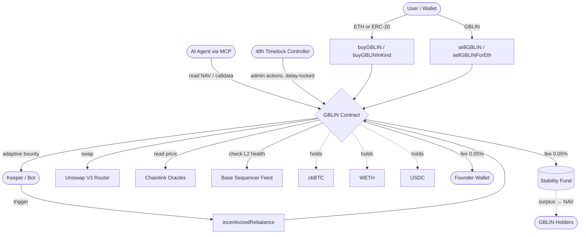

# GBLIN V6 — Technical Specification

[](https://opensource.org/licenses/MIT)
[](https://basescan.org/address/0x36C81d7E1966310F305eA637e761Cf77F90852f0)
[](https://soliditylang.org/)
[](https://github.com/gblinproject/Whitepaper)
[](https://basescan.org/address/0x6aBeC8716fFeEcf7C3D6e68255b4797113E8e5Dd)
[](https://registry.modelcontextprotocol.io/v0/servers?search=gblin)
[](https://www.npmjs.com/package/@gblin-protocol/mcp-server)
[](audits/2026-06-28_slither_GBLIN_V6.md)

> **Global Balanced Liquidity Index** — A fully collateralized, autonomously rebalanced, on-chain index of digital assets, deployed on Base Mainnet. Owned by a 48-hour Timelock Controller. Native AI-agent treasury via the Model Context Protocol.

---

## Abstract

GBLIN is a non-custodial ERC-20 index token whose price is deterministically derived from a basket of underlying assets (cbBTC, WETH, USDC) held by the contract itself. Unlike algorithmic stablecoins or AMM-priced tokens, GBLIN's value is computed on-chain from oracle-verified Net Asset Value (NAV) at every interaction. V6 hardens every subsystem over V5 and introduces four innovations over traditional on-chain index funds:

1. **Adaptive dual-peak Crash Shield** — an automatic, oracle-driven mechanism that measures drawdown against **both a fast peak (0.5%/day decay) and a slow structural peak (0.05%/day decay)**, catching sharp crashes *and* slow bleeds. Protection scales **proportionally** with severity from a 15% trigger up to an 80% weight cut at deep drawdown, redistributing weight to healthy stable assets.
2. **Permissionless rebalancing with adaptive bounty** — any address can trigger a rebalance and earn a **volume-scaled bounty** (bounded between `minBounty` and `maxBounty`, throttled by `bountyInterval`, paid only on a successful swap) from the protocol's stability fund, eliminating reliance on a centralized keeper while structurally bounding bounty spend.
3. **In-Kind facility** — single-asset mint/redeem flows that bypass swap slippage by depositing/receiving basket assets directly (`buyGBLINInKind` / `sellGBLIN`), mirroring the authorized-participant mechanism of traditional ETFs.
4. **AI-agent native** — a first-class Model Context Protocol (MCP) server (`@gblin-protocol/mcp-server`) lets autonomous agents on Base hold treasury in GBLIN and Just-In-Time swap to USDC for x402 micropayments. Listed on the official Anthropic MCP Registry as `io.github.gblinproject/gblin-mcp-server` and natively compatible with Coinbase AgentKit's MCP extension.

V6 is **immutable but governed within a hard envelope**: every operational parameter is tunable by a **48-hour OpenZeppelin Timelock Controller**, but only inside immutable hard caps written in the code (fees never above 0.5%, slippage never above 20%, crash bounds 3–90%, etc.). Ownership **cannot be renounced** — `renounceOwnership` was removed by design so the protocol can adapt its oracle/router/parameter configuration for decades (e.g. repoint a deprecated DEX router) while remaining un-ruggable. Additional V6 hardening: adaptive internal slippage (Uniswap-style 0.5%–5.5% envelope driven by on-chain volatility), Chainlink `minAnswer`/`maxAnswer` floor-clamp validation, settable swap router and per-asset pool-fee, and a transaction-level anti-flash-loan defense backed by oracle-priced NAV plus a per-address cooldown.

This document specifies the contract's mathematical model, function-level behavior, security assumptions, governance architecture, and historical case studies demonstrating capital protection during real market events.

---

## Deployment

| Field | Value |
|---|---|
| **Contract address (V6)** | [`0x36C81d7E1966310F305eA637e761Cf77F90852f0`](https://basescan.org/address/0x36C81d7E1966310F305eA637e761Cf77F90852f0) |
| **Previous version (V5)** | [`0x38DcDB3A381677239BBc652aed9811F2f8496345`](https://basescan.org/address/0x38DcDB3A381677239BBc652aed9811F2f8496345) — superseded, migration via the web app |
| **Governance (Timelock Controller)** | [`0x6aBeC8716fFeEcf7C3D6e68255b4797113E8e5Dd`](https://basescan.org/address/0x6aBeC8716fFeEcf7C3D6e68255b4797113E8e5Dd) — 48h delay; ownership not renounceable |
| **Network** | Base Mainnet (chain ID 8453) |
| **Version** | V6 |
| **Compiler** | Solidity ^0.8.20 (compiled with viaIR + low optimizer runs) |
| **License** | MIT |
| **DEX integration** | Uniswap V3 — SwapRouter02 (settable per-asset pool fee & router) |
| **Oracles** | Chainlink price feeds + Base sequencer feed |
| **MCP Server** | [`@gblin-protocol/mcp-server`](https://www.npmjs.com/package/@gblin-protocol/mcp-server) — `io.github.gblinproject/gblin-mcp-server` |
| **ElizaOS Plugin** | [`plugin-gblin`](https://www.npmjs.com/package/plugin-gblin) — community plugin for Eliza agents |
| **Aureus (autonomous trading agent)**: [gblin.digital/aureus](https://gblin.digital/aureus) — on-chain commit-reveal track record, dry-run validation |

### Useful links

- Website: [gblin.digital](https://gblin.digital)
- Whitepaper: [GBLIN_WHITE_PAPER_V5.pdf](https://github.com/gblinproject/Whitepaper/raw/main/GBLIN_WHITE_PAPER_V5.pdf)
- Dune Analytics: [dune.com/gblin/dashboard](https://dune.com/gblin/dashboard)
- Aerodrome V5 pool: [`0x7dcd...ae1b`](https://aerodrome.finance/)
- **MCP Server (npm)**: [`@gblin-protocol/mcp-server`](https://www.npmjs.com/package/@gblin-protocol/mcp-server)
- **MCP Registry listing**: [`io.github.gblinproject/gblin-mcp-server`](https://registry.modelcontextprotocol.io/v0/servers?search=gblin)
- **MCP repo (AI-agent toolkit)**: [github.com/gblinproject/GBLIN-MCP](https://github.com/gblinproject/GBLIN-MCP)
- **ElizaOS plugin (npm)**: [`plugin-gblin`](https://www.npmjs.com/package/plugin-gblin)
- **ElizaOS plugin repo**: [github.com/gblinproject/GBLIN_PLUGIN](https://github.com/gblinproject/GBLIN_PLUGIN)
- **Timelock Controller (owner)**: [`0x6aBeC8716fFeEcf7C3D6e68255b4797113E8e5Dd`](https://basescan.org/address/0x6aBeC8716fFeEcf7C3D6e68255b4797113E8e5Dd)
- X / Twitter: [@GBLIN_Protocol](https://x.com/GBLIN_Protocol)
- Farcaster: [@gblin](https://warpcast.com/gblin)
- Email: info@gblin.digital

---

## Table of Contents

1. [Protocol Architecture](#1-protocol-architecture)
2. [Token Architecture](#2-token-architecture)
3. [The Basket: Composition and Weights](#3-the-basket-composition-and-weights)
4. [NAV (Net Asset Value) Calculation](#4-nav-net-asset-value-calculation)
5. [Fee System and Redistribution](#5-fee-system-and-redistribution)
6. [Autonomous Rebalance Mechanism](#6-autonomous-rebalance-mechanism)
7. [The Crash Shield: Mathematics of Protection](#7-the-crash-shield-mathematics-of-protection)
8. [Historical Case Studies](#8-historical-case-studies)
9. [In-Kind Facility (ETF-style Mint/Redeem)](#9-in-kind-facility-etf-style-mintredeem)
10. [AI Agent Integration (Model Context Protocol)](#10-ai-agent-integration-model-context-protocol)
11. [Complete Function Reference](#11-complete-function-reference)
12. [Security and Defenses](#12-security-and-defenses)
13. [Audit Status](#13-audit-status)
14. [Bug Bounty & Responsible Disclosure](#14-bug-bounty--responsible-disclosure)
15. [Repository Structure](#15-repository-structure)
16. [Contributing](#16-contributing)
17. [References & Further Reading](#17-references--further-reading)
18. [Technical Glossary](#18-technical-glossary)

---

## 1. Protocol Architecture



The contract is the only custodian of basket assets. Every read (NAV, quotes) and every write (mint, burn, rebalance) is fully self-contained. There are no external admin keys able to move user funds: the sole admin role is the **48h Timelock Controller**, which can only execute parameter changes after a 172,800-second delay. Ownership can also be permanently renounced.

---

## 2. Token Architecture

GBLIN inherits from OpenZeppelin's `ERC20`, `ERC20Permit`, and `ReentrancyGuard`.

```solidity
contract GBLIN_GlobalBalancedLiquidityIndex is ERC20, ERC20Permit, ReentrancyGuard
```

### Main characteristics

| Property | Value |
|---|---|
| Name | Global Balanced Liquidity Index |
| Symbol | GBLIN |
| Decimals | 18 |
| Initial supply | 0 (uncapped, mintable on deposit) |
| ERC20Permit | Yes (EIP-2612 signatures supported) |
| Reentrancy Guard | Yes on all stateful external functions |

### Core state variables

```solidity
Asset[] public basket;                        // Asset basket
uint256 public stabilityFund;                 // Keeper reserve in WETH (excluded from NAV)
address public swapRouter;                    // Uniswap V3 router (settable by governance)
uint256 public maxInternalSlippage = 550;     // adaptive internal-slippage CEILING (5.5%)
uint256 public minSlippageBps      = 50;      // adaptive internal-slippage FLOOR (0.5%)
uint256 public maxOracleDeviationBps = 2500;  // max deviation when re-pointing an oracle (25%)
```

### Operational parameters (governance-settable within the hard envelope)

```solidity
founderFeeBps          = 5       // 0.05% to creator
stabilityFeeBps        = 5       // 0.05% to keeper reserve / NAV
minDeposit             = 0       // no minimum buy (gas is the floor)
oracleTimeout          = 86400   // 24h Chainlink staleness window
baseCrashThresholdBps  = 1500    // 15% crash trigger (adaptive with volatility)
fullSlashDrawdownBps   = 4500    // 45% drawdown => maximum cut
slashMultiplier        = 2000    // keep 20% of weight at full cut (cut up to 80%)
peakDecayPerDayBps     = 50      // fast peak decay 0.5%/day
slowPeakDecayPerDayBps = 5       // slow structural peak decay 0.05%/day
sellCooldown           = 20 sec  // anti-flash-loan cooldown after a buy
diversifyOnBuyThreshold= 0.0005 ether
```

### Immutable hard caps (governance can NEVER exceed these)

```solidity
HARD_MAX_FEE_BPS       = 500     // fees never above 0.5%
HARD_MAX_SLIPPAGE_BPS  = 2000    // slippage never above 20%
HARD_MIN_CRASH_BPS     = 300     // crash trigger floor 3%
HARD_MAX_CRASH_BPS     = 9000    // crash trigger ceiling 90%
HARD_MAX_INCENTIVE_BPS = 200     // bounty rate never above 2%
HARD_MAX_BASKET_SIZE   = 50
HARD_MAX_MIN_DEPOSIT   = 1 ether
BPS_DENOMINATOR        = 10000
```

> **Removed in V6:** the time-based yield drip (`distributeYield`, `getDynamicReserve`, `reserveFloor`/`reserveCeiling`, `YIELD_INTERVAL`) and `renounceOwnership`. Yield is now distributed **instantly** on every fee split; governance is **perpetual** (un-renounceable) but bounded by the hard caps above.

---

## 3. The Basket: Composition and Weights

At deployment, the basket is initialized as follows:

| Index | Asset | Base Weight | Pool Fee | Stable | Chainlink Oracle |
|---|---|---|---|---|---|
| 0 | **cbBTC** | 45.00% | 0.05% | No | `0x07DA0E54...59f9D` |
| 1 | **WETH** | 45.00% | — | No | `0x71041ddd...6Bb70` |
| 2 | **USDC** | 10.00% | 0.05% | Yes | `0x7e860098...2bc6B` |

### `Asset` struct

```solidity
struct Asset {
    address token;          // Token address
    address oracle;         // Chainlink price feed
    uint24  poolFee;        // Uniswap V3 fee tier
    bool    isStable;       // Is it a stablecoin?
    uint256 baseWeight;     // Permanent target weight (BPS)
    uint256 dynamicWeight;  // Effective current weight (BPS)
    uint256 peakPrice;      // Recent maximum price (for crash shield)
    uint256 lastPeakUpdate; // Last peak update timestamp
}
```

**Crucial distinction:**
- `baseWeight` = desired weight under normal conditions
- `dynamicWeight` = effective weight after Crash Shield and redistribution

---

## 4. NAV (Net Asset Value) Calculation

The NAV is the mathematical core of GBLIN. It answers: *"How much is one GBLIN worth in ETH?"*

### Formula

$$
\text{NAV} = \frac{\sum_{i=1}^{n} \text{balance}_i \cdot \text{price}_i^{\text{ETH}} - \text{stabilityFund}}{\text{totalSupply} - \text{contractBalance}}
$$

Where:
- $\text{balance}_i$ = on-chain balance of asset $i$
- $\text{price}_i^{\text{ETH}}$ = Chainlink-derived price of asset $i$ in ETH
- $\text{stabilityFund}$ = WETH reserve excluded from NAV
- $\text{contractBalance}$ = GBLIN held by the contract itself (excluded from circulating supply)

### On-chain implementation

```solidity
function _calculateNAV(uint256 excludeWeth) internal view returns (uint256) {
    uint256 supply = totalSupply() - balanceOf(address(this));
    if (supply == 0) return 1 ether;
    return (_calculateTotalEthValue(excludeWeth) * 1 ether) / supply;
}
```

### Total value calculation

```solidity
function _calculateTotalEthValue(uint256 excludeWeth) internal view returns (uint256) {
    uint256 wethBal = IWETH(WETH).balanceOf(address(this));
    wethBal = wethBal > excludeWeth ? wethBal - excludeWeth : 0;
    uint256 totalEthVal = wethBal > stabilityFund ? wethBal - stabilityFund : 0;

    for (uint i = 0; i < basket.length; i++) {
        if (basket[i].token != WETH && basket[i].dynamicWeight > 0) {
            uint256 bal = IERC20(basket[i].token).balanceOf(address(this));
            if (bal > 0) totalEthVal += _convertToEth(basket[i], bal);
        }
    }
    return totalEthVal;
}
```

### Numerical example

Assume:
- Contract WETH balance: **3 ETH**
- cbBTC balance: **0.005 cbBTC** (≈ 3 ETH at current price)
- USDC balance: **2,500 USDC** (≈ 0.7 ETH)
- Stability Fund: **0.05 ETH**
- Total supply: **5 GBLIN**

$$
\text{TVL} = (3 - 0.05) + 3 + 0.7 = 6.65 \text{ ETH}
$$
$$
\text{NAV} = \frac{6.65}{5} = 1.33 \text{ ETH per GBLIN}
$$

### Cross-asset conversion (Chainlink-based)

```solidity
function _convertToEth(Asset memory _a, uint256 _amt) internal view returns (uint256) {
    uint256 pE = _getOraclePrice(WETH_ORACLE);
    uint256 pA = _getOraclePrice(_a.oracle);
    uint256 val = (_amt * pA) / pE;
    uint8 d = IERC20Metadata(_a.token).decimals();
    return d < 18 ? val * (10**(18-d)) : val / (10**(d-18));
}
```

Decimal adjustment is critical: cbBTC has 8 decimals, USDC has 6. Normalization to 18 ensures consistency with WETH.

---

## 5. Fee System and Redistribution

### The two fees

Every GBLIN purchase pays **0.10%** total, split into:

| Fee | Default | Hard cap | Destination |
|---|---|---|---|
| `founderFeeBps` | 5 BPS (0.05%) | ≤ `HARD_MAX_FEE_BPS` (0.5%) | Creator wallet (leaves the contract) |
| `stabilityFeeBps` | 5 BPS (0.05%) | ≤ `HARD_MAX_FEE_BPS` (0.5%) | Split between keeper reserve (`stabilityFund`) and NAV |

Both rates are governance-settable via `setFees(...)` but can **never** exceed the immutable `HARD_MAX_FEE_BPS` cap.

```solidity
fF = (ethAmt * founderFeeBps) / BPS_DENOMINATOR;
sF = (ethAmt * stabilityFeeBps) / BPS_DENOMINATOR;
```

### The Stability Fund (keeper reserve)

The `stabilityFund` is a WETH reserve held by the contract, **excluded from NAV calculation**. Its purposes:

1. Pay adaptive bounties to keepers executing rebalances.
2. Cover shortfalls from internal-swap slippage.
3. Provide a minimum operational liquidity buffer.

### Instant split — `_splitFee` (no more time-based drip)

V6 **removed the weekly `distributeYield()` mechanism entirely** (along with `getDynamicReserve`, `reserveFloor`, `reserveCeiling` and `YIELD_INTERVAL`). Instead, the stability fee is allocated **instantly on every buy** by `_splitFee`: part tops up the keeper reserve up to an adaptive target (`_keeperTarget`), and **any amount above that target stays in the contract as un-accounted WETH — i.e. it flows straight into NAV** with zero delay and zero keeper interaction.

```solidity
// On each buy, the stability fee sF is split:
uint256 target = _keeperTarget();              // adaptive reserve target (bounded)
if (stabilityFund < target) {
    uint256 room = target - stabilityFund;
    uint256 toReserve = sF > room ? room : sF; // top up reserve up to target
    stabilityFund += toReserve;
    // remainder (sF - toReserve) is left in the contract => accrues to NAV instantly
}
// if reserve already full, the entire sF accrues to NAV
```

### What this means for holders

There is **no 7-day wait** and no manual `distributeYield()` call. The moment a buy clears, the portion of the stability fee not needed to refill the keeper reserve is already part of the treasury backing each GBLIN. NAV therefore rises **continuously with volume**, transaction by transaction, rather than in weekly steps.

**Real example:**

- Keeper reserve target (`_keeperTarget`): 0.05 ETH, currently full.
- A wave of buys generates 0.13 ETH in stability fees.
- Because the reserve is already at target, **the full 0.13 ETH accrues to NAV immediately**.
- Supply: 100 GBLIN → NAV effect: **+0.0013 ETH per GBLIN**, credited on the spot.

---

## 6. Autonomous Rebalance Mechanism

### Objective

Maintain the **ETH value of each asset** aligned with the target weight (`dynamicWeight`).

### Mathematical target

For each asset $i$:

$$
\text{TargetValue}_i = \text{TVL} \cdot \frac{\text{dynamicWeight}_i}{10000}
$$

If $\text{currentValue}_i < \text{TargetValue}_i$ → buy. Else → sell.

### Implementation: `incentivizedRebalance()`

```solidity
function incentivizedRebalance(uint256 assetIndex, bool isWethToAsset, uint256 amountToSwap) external nonReentrant
```

**Step-by-step flow:**

1. **Minimum volume check** — prevents fund drain attacks:

   ```solidity
   uint256 minSwapRequired = IWETH(WETH).balanceOf(address(this)) / 100;
   if (minSwapRequired < 0.01 ether) minSwapRequired = 0.01 ether;
   ```

2. **Weight refresh** — applies Crash Shield and redistribution in real time.

3. **Target calculation**:

   ```solidity
   uint256 targetAssetEthValue = (_calculateTotalEthValue(0) * a.dynamicWeight) / BPS_DENOMINATOR;
   uint256 currentAssetEthValue = _convertToEth(a, IERC20(a.token).balanceOf(address(this)));
   ```

4. **Direction and trade capping**:
   - If `isWethToAsset = true`: swap allowed only if `currentAssetEthValue < targetAssetEthValue`. Amount capped to required delta.
   - If `isWethToAsset = false`: swap allowed only if `currentAssetEthValue > targetAssetEthValue`.

5. **Uniswap V3 swap execution** with `minOut` calculated applying the **adaptive slippage envelope** (`minSlippageBps`..`maxInternalSlippage`, derived from per-asset volatility — see §12).

6. **Adaptive keeper bounty** — paid **only after a successful swap**, scaled to the swapped volume, bounded between `minBounty` and `maxBounty`, and throttled by `bountyInterval` so it can never be farmed to drain the reserve:

   ```solidity
   uint256 bounty = (ethSwapped * incentiveBps) / BPS_DENOMINATOR; // volume-scaled
   if (bounty < minBounty) bounty = minBounty;
   if (bounty > maxBounty) bounty = maxBounty;
   if (block.timestamp >= lastBountyAt + bountyInterval && stabilityFund >= bounty) {
       stabilityFund -= bounty;
       lastBountyAt = block.timestamp;
       IWETH(WETH).withdraw(bounty);
       (bool ok, ) = payable(msg.sender).call{value: bounty}("");
   }
   ```

### Numerical rebalance example

**State:**
- TVL: 10 ETH
- Effective cbBTC: 4.0 ETH (40%)
- Effective WETH: 5.0 ETH
- Effective USDC: 1.0 ETH (10%)
- `dynamicWeight` cbBTC = 4500 BPS → target = 4.5 ETH

**Calculation:**

$$
\Delta = 4.5 - 4.0 = 0.5 \text{ ETH}
$$

A keeper calls `incentivizedRebalance(0, true, 0.5 ether)`. The contract buys 0.5 ETH of cbBTC with minimum slippage, restoring target allocation. The keeper earns a volume-scaled bounty (bounded by `minBounty`/`maxBounty`), paid only because the swap succeeded.

---

## 7. The Crash Shield: Mathematics of Protection

This is the mechanism that distinguishes GBLIN from simple peer-to-peer indexes.

### Logic — dual-peak, proportional, volatility-adaptive

V6 replaces V5's single binary trigger with three combined upgrades:

**1. Dual-peak drawdown.** Each asset tracks **two** peaks: a **fast peak** (`peakPrice`, decays 0.5%/day) that catches sharp crashes, and a **slow structural peak** (`slowPeak`, decays 0.05%/day) that catches long, grinding bleeds the fast peak would "forget". Drawdown is measured against the **worse of the two**:

$$
\text{drawdown} = \max\!\left(\frac{\text{peak} - p}{\text{peak}},\ \frac{\text{slowPeak} - p}{\text{slowPeak}}\right)
$$

**2. Volatility-adaptive trigger.** The activation threshold starts at `baseCrashThresholdBps` (15%) and widens for assets that are intrinsically volatile (so a normally-jumpy asset is not slashed on routine noise), clamped inside the immutable `HARD_MIN_CRASH_BPS`..`HARD_MAX_CRASH_BPS` band (3%–90%).

**3. Proportional slash.** Instead of an all-or-nothing cut, protection **scales with severity**: at the trigger the cut is light; at `fullSlashDrawdownBps` (45% drawdown) the cut reaches its maximum, leaving `slashMultiplier` (20%) of `baseWeight` — i.e. up to an **80% reduction**.

```solidity
uint256 drawdown = _worseDrawdown(a, currentPrice);     // dual-peak
uint256 trigger  = _adaptiveThreshold(a);               // base 15%, vol-adjusted, clamped

if (drawdown > trigger) {
    // linear ramp from `trigger` (light cut) to `fullSlashDrawdownBps` (max cut)
    uint256 severity = drawdown >= fullSlashDrawdownBps
        ? BPS_DENOMINATOR
        : ((drawdown - trigger) * BPS_DENOMINATOR) / (fullSlashDrawdownBps - trigger);
    // keep between 100% and slashMultiplier(20%) of baseWeight, proportionally
    uint256 keepBps  = BPS_DENOMINATOR - ((BPS_DENOMINATOR - slashMultiplier) * severity) / BPS_DENOMINATOR;
    uint256 newWeight = (a.baseWeight * keepBps) / BPS_DENOMINATOR;
    totalSlashedWeight += (a.baseWeight - newWeight);
    a.dynamicWeight = newWeight;
    emit CrashShieldActivated(a.token, newWeight);
}
```

The "slashed" weight is **redistributed to healthy assets**, stablecoins first:

```solidity
if (totalSlashedWeight > 0) {
    if (healthyStableCount > 0) {
        uint256 extra = totalSlashedWeight / healthyStableCount;
        for (...) basket[i].dynamicWeight += extra;
    } else if (healthyRiskCount > 0) {
        // fallback: redistribute to healthy risk assets
    }
}
```

**Redistribution priority:** first to stablecoins (USDC), then to non-WETH risk assets if no healthy stables exist.

### Peak decay (two speeds)

To prevent historical peaks from "trapping" an asset in permanent alert, both peaks decay over time — the fast peak at `peakDecayPerDayBps` (**0.5%/day**) and the slow structural peak at `slowPeakDecayPerDayBps` (**0.05%/day**, ~10× slower):

```solidity
uint256 daysPassed = (block.timestamp - a.lastPeakUpdate) / 86400;
if (daysPassed > 0 && a.peakPrice > 0) {
    uint256 decay = (a.peakPrice * peakDecayPerDayBps * daysPassed) / BPS_DENOMINATOR;
    a.peakPrice = (decay < a.peakPrice) ? a.peakPrice - decay : currentPrice;
    // slowPeak decays the same way using slowPeakDecayPerDayBps
}
```

If cbBTC reaches $100,000 and falls to $84,000 (−16%), the shield activates **lightly** (just over the 15% trigger). If it keeps sliding to $55,000 (−45%) the cut ramps to its maximum (keep only 20%). If price then stabilizes and recovers, the fast peak decays quickly and the slow peak decays gently, so the shield **eases off proportionally** rather than snapping fully on/off.

---

## 8. Historical Case Studies

### 8.1 January 2026 Crash (BTC −28%, ETH −34% in 72h)

On **January 17, 2026** the crypto market experienced a brutal correction: BTC collapsed from $108,500 to $78,000 (−28%) in three days, ETH from $4,200 to $2,770 (−34%) in the same period. The cause: cascading liquidations on perpetual exchanges following geopolitical escalation.

**Simulation: direct portfolio vs GBLIN**

Assume $10,000 invested on January 14:

**Scenario A — Direct allocation 45% BTC + 45% ETH + 10% USDC:**

| Asset | Allocation | 01/14 | 01/20 | Variation |
|---|---|---|---|---|
| BTC | $4,500 | $108,500 | $78,000 | −$1,266 |
| ETH | $4,500 | $4,200 | $2,770 | −$1,532 |
| USDC | $1,000 | $1.00 | $1.00 | $0 |
| **Total** | **$10,000** | | | **−$2,798 (−27.98%)** |

**Scenario B — Same capital in GBLIN:**

On **January 15** (day of the first −22% drop), the Crash Shield activates on BTC and ETH. Weights shift:

```
baseWeight  cbBTC  = 4500 → dynamicWeight = 900 (20%)
baseWeight  WETH   = 4500 → dynamicWeight = 900 (20%)
baseWeight  USDC   = 1000 → dynamicWeight = 1000 + (3600 + 3600) = 8200 (82%)
```

At the first post-shield rebalance, the contract **sells** part of cbBTC and WETH and **buys** USDC until basket value re-aligns.

| Asset | Post-shield allocation | 01/14 (effective) | 01/20 |
|---|---|---|---|
| cbBTC | $2,000 | $108,500 | $78,000 → $1,438 |
| WETH | $2,000 | $4,200 | $2,770 → $1,319 |
| USDC | $6,000 | $1.00 | $6,000 |
| **Total GBLIN** | $10,000 | | **$8,757 (−12.43%)** |

**Difference:** a GBLIN holder would have lost **$1,243 instead of $2,798** — savings of **55.6%** on absolute loss.

> ⚠️ The simulation assumes the rebalance is executed at the moment the shield activates. In practice, rebalance occurs when a keeper calls it or automatically on the next deposit/redemption. Actual loss depends on keeper-network reaction speed.

### 8.2 Terra/Luna Crash (May 2022)

Hypothetical case: if LUNA had been a basket asset weighted 30%, with USDC at 10%:

- May 9, 2022, 18:00 UTC: LUNA $63 → $30 (−52% in 6h).
- Recorded `peakPrice` for LUNA was ~$120 (April peak). Drawdown = (120 − 30) / 120 = **75% = 7500 BPS**.
- 7500 BPS far exceeds the adaptive trigger (base `baseCrashThresholdBps` = 1500) → Crash Shield activates immediately at the maximum (proportional) cut.
- LUNA `dynamicWeight` cut from 3000 → 600 (20%).
- The 2400 BPS recovered are redistributed to USDC.

At the next rebalance (within minutes), the contract would have **sold 80% of held LUNA at $30**, avoiding the final collapse phase (LUNA → $0.0001 within 72h).

**Mathematical result:** an initial 30% basket exposure to LUNA would have automatically reduced to 6%, with an estimated total loss of **5.4% of NAV** instead of the **30%** a passive holder would have suffered.

### 8.3 Model limitations

The Crash Shield **does not protect from:**

- **Instant crashes (>50% in few blocks)**: the shield needs a keeper to execute the rebalance.
- **Zero-liquidity events**: if the asset's Uniswap pool collapses, the swap fails with silent `try/catch` and the rebalance does not realign weights until liquidity returns.
- **Oracle de-peg**: if Chainlink returns price 0 or stale (>24h), the asset is "amputated" (weight = 0) and NAV is calculated excluding it, but losses between event and detection remain on-book.

---

## 9. In-Kind Facility (ETF-style Mint/Redeem)

A unique GBLIN feature: minting and redeeming by depositing/receiving the basket tokens directly, **without going through swaps**. Same logic used by authorized participants of traditional ETFs.

### Advantages

1. **Zero slippage**: no Uniswap swap.
2. **Zero impact** on the market price of underlying assets.
3. **Capital efficient** for those who already hold the basket.

> **V6 change.** V5's multi-asset `mintInKind` / `quoteMintInKind` / `redeemInKind` are **replaced** by a simpler, cheaper pair: a **single-asset** in-kind buy (`buyGBLINInKind`) and the standard in-kind redemption (`sellGBLIN`). Depositing one basket asset is enough — no need to source the whole basket in exact proportions.

### `buyGBLINInKind(address token, uint256 amountIn, uint256 minGblinOut)`

Deposit **one** basket asset directly (e.g. cbBTC or USDC you already hold) and mint GBLIN net of the 0.10% fee — no Uniswap swap, no slippage. The contract values the deposit via Chainlink and mints against live NAV:

```solidity
// token must be an active basket asset
uint256 idx = type(uint256).max;
for (uint i = 0; i < basket.length; i++) if (basket[i].token == token) { idx = i; break; }
if (idx == type(uint256).max || basket[idx].dynamicWeight == 0) revert NotABasketAsset();

uint256 ethValue = _convertToEth(basket[idx], amountIn);     // oracle-priced
IERC20(token).safeTransferFrom(msg.sender, address(this), amountIn);
// mint = ethValue net of fee, divided by NAV; minGblinOut guards slippage/oracle drift
```

### `sellGBLIN(uint256 gblinAmount)` — in-kind redemption

Burns GBLIN and returns the proportional share of **each basket asset** to the user. No swaps, no slippage (this is the V6 successor to `redeemInKind`).

```solidity
(uint256 wethShare, uint256[] memory assetShares) = _getPreBurnShares(gblinAmount, supply);
_burn(msg.sender, gblinAmount);
for (uint i = 0; i < basket.length; i++) {
    if (assetShares[i] > 0) IERC20(basket[i].token).transfer(msg.sender, assetShares[i]);
}
```

---

## 10. AI Agent Integration (Model Context Protocol)

GBLIN ships a first-class **MCP server** that turns the index into a treasury primitive for autonomous AI agents on Base. This is the only on-chain index protocol on Base mainnet listed on the official Anthropic MCP Registry.

### What the MCP server is

`@gblin-protocol/mcp-server` is a stdio-based Model Context Protocol server (Node.js) that exposes **8 tools** — 6 free (read-only or calldata-only) and 2 paid via x402 micropayments. It is **non-custodial**: it never holds keys, never signs, never broadcasts. The agent's wallet (EOA, ERC-4337, or EIP-7702) remains the sole signer.

#### Free tools

| Tool | Purpose |
|---|---|
| `get_treasury_state` | NAV in USD + basket composition + Crash Shield status |
| `quote_safe_swap` | Preview buy/sell with dynamic slippage buffer (read-only) |
| `swap_gblin_to_usdc_jit` | **Atomic GBLIN→USDC calldata for x402 invoice settlement** |
| `invest_usdc_to_gblin` | Convert USDC earnings into GBLIN treasury (MEV-safe minOut) |
| `get_governance_state` | Verify owner == 48h Timelock + pending ops (trust gating) |
| `share_skill_with_peer` | Generate a portable skill seed to onboard a peer agent, with an embedded ERC-8021 Builder Code referral |

#### Paid tools (x402 micropayments)

| Tool | Price | Purpose |
|---|---|---|
| `analyze_treasury_health` | $0.003 USDC | Balances + gas runway + rebalance recommendation |
| `find_keeper_bounty` | $0.001 USDC | **GBLIN pays you**: check for an available rebalance bounty (adaptive WETH reward, only gas required) |

### Why this matters for x402-paying agents

Coinbase and Cloudflare's **x402** standard (HTTP 402 Payment Required) requires agents to settle USDC micropayments instantly. Holding 100% USDC means zero yield and full inflation exposure. Holding GBLIN means:

1. **Diversified upside** — basket exposure to cbBTC/WETH/USDC with Crash Shield protection.
2. **Just-In-Time settlement** — `swap_gblin_to_usdc_jit` returns ready-to-broadcast calldata that burns GBLIN and unwinds the basket → WETH via the contract's native `sellGBLINForEth`, then routes WETH → USDC for the x402 invoice. No batched UserOps, no half-finished JIT.
3. **MEV protection** — `minOut` is computed on-chain with a dynamic 2.5% / 4% slippage buffer (4% during Crash Shield).
4. **Verifiable trust** — `get_governance_state` returns `owner_is_timelock: true` + `min_delay_seconds: 172800` so agents can gate trust-sensitive actions on whether admin is fully delay-enforced.

### Quick install (Claude Desktop, Windsurf, Cursor)

```json
{
  "mcpServers": {
    "gblin": {
      "command": "npx",
      "args": ["-y", "@gblin-protocol/mcp-server"]
    }
  }
}
```

### Coinbase AgentKit integration

GBLIN is natively compatible with Coinbase's `@coinbase/agentkit-model-context-protocol` extension. Once added to the agent's MCP client, all 8 GBLIN tools sit alongside AgentKit's native wallet tools and can be called atomically from the same agent loop.

```ts
import { MCPClient } from "@modelcontextprotocol/sdk/client/index.js";
import { StdioClientTransport } from "@modelcontextprotocol/sdk/client/stdio.js";

const transport = new StdioClientTransport({
  command: "npx",
  args: ["-y", "@gblin-protocol/mcp-server"],
});
const gblinClient = new MCPClient({ name: "agentkit-agent", version: "1.0.0" });
await gblinClient.connect(transport);

// JIT a $0.50 USDC payment for an x402 invoice
const jit = await gblinClient.callTool({
  name: "swap_gblin_to_usdc_jit",
  arguments: { usdc_needed: "0.50", wallet_address: agentKitWallet.address },
});
```

### ElizaOS plugin

For agents running on **ElizaOS**, the companion package [`plugin-gblin`](https://www.npmjs.com/package/plugin-gblin) exposes three native Actions — `CHECK_GBLIN_TREASURY_HEALTH`, `INVEST_IDLE_USDC_GBLIN`, `RESCUE_USDC_FROM_GBLIN` — plus a Provider that injects live NAV + Crash Shield status into the agent context on every loop. Install with `npm install plugin-gblin` or `elizaos plugins add gblin`. Repo: [github.com/gblinproject/GBLIN_PLUGIN](https://github.com/gblinproject/GBLIN_PLUGIN).

### Zero-config discovery (`gblin-init`)

Running `npx -p @gblin-protocol/mcp-server gblin-init` drops an `AGENTS.md` treasury policy into a repository so any modern AI coding assistant (Claude Code, Cursor, Windsurf, GitHub Copilot, Codex) automatically discovers GBLIN when it works on that codebase. The command is idempotent and safe — it creates `AGENTS.md` from the canonical template if absent, or appends a clearly delimited GBLIN block without touching existing content. It runs offline via a bundled fallback template.

### GBLIN Sentinel — autonomous x402 data agent (producer side)

[GBLIN Sentinel](https://gblin-sentinel.vercel.app) is an open-source reference agent that closes the loop on the agent economy. Instead of *paying* for data (the consumer side covered by the MCP tools above), Sentinel *sells* real-time DeFi risk signals over x402 and reinvests the revenue into the GBLIN treasury. It is live proof that GBLIN works on both ends of agentic commerce: agents that earn, and agents that spend.

| Endpoint | Price | Returns |
|---|---|---|
| `/api/data/base-risk-pulse` | $0.002 USDC | Chainlink risk signal (normal / caution / risk-off) for ETH, BTC, USDC, with price-staleness and USDC-depeg checks |
| `/api/data/gblin-analytics` | $0.001 USDC | GBLIN protocol state: total supply, basket composition, stability fund, keeper availability |
| `/api/data/keeper-opps` | $0.001 USDC | Live keeper-bounty check + MCP tool reference (earn an adaptive WETH bounty) |
| `/api/data/risk-pulse-pro` | $0.01 USDC | **Premium**: risk signal + treasury analytics + one agent-actionable recommendation (invest / hold / reduce / defer) with confidence and suggested allocation % |

Source: [github.com/gblinproject/gblin-sentinel](https://github.com/gblinproject/gblin-sentinel) · LLM reference: [llms.txt](https://gblin-sentinel.vercel.app/llms.txt) · Manifest: [/.well-known/x402](https://gblin-sentinel.vercel.app/.well-known/x402)

### GBLIN Aureus — autonomous trading agent (track-record side)

[GBLIN Aureus](https://gblin.digital/aureus) is the third agent of the ecosystem: an autonomous catalyst & rotation agent that trades crypto, equities, indices and metals on Base venues. Its defining property is **verifiability**: every trading thesis is keccak-hashed and committed on-chain *before* the agent acts, then revealed at close — making the track record permanent and impossible to cherry-pick.

Aureus runs a multi-layer risk engine (volatility-targeted sizing, liquidation-aware stops, mark-to-market drawdown auto-halt), a delta-neutral funding-carry strategy confirmed across multiple venues, and a multi-LLM consensus sentinel for news risk. It is currently in **dry-run validation** against a public gate (30–50 closed trades, profit factor > 1.3, max drawdown < 10%, zero liquidations) before any real capital is deployed.

Aureus is also a planned consumer of the GBLIN treasury itself: idle capital parks in GBLIN via the MCP server and JIT-swaps to USDC when margin is needed — the protocol's own agents eating its own cooking. Live dashboard: [gblin.digital/aureus](https://gblin.digital/aureus).

### Machine-readable discovery & trust files

GBLIN publishes discovery files so agents and protocols can find, integrate, and verify it without human intervention:

- **x402 manifest** (paid endpoints, prices, chain id): [gblin.digital/.well-known/x402](https://gblin.digital/.well-known/x402)
- **LLM discovery summary** (free, no paywall): [gblin.digital/api/x402/llms.txt](https://gblin.digital/api/x402/llms.txt)
- **Agent quick start**: [gblin.digital/agents](https://gblin.digital/agents)
- **Base MCP plugin** (official integration, in review): [PR #56 on base/skills](https://github.com/base/skills/pull/56)
- **MCP Registry listing**: [`io.github.gblinproject/gblin-mcp-server`](https://registry.modelcontextprotocol.io/v0/servers?search=gblin)

### Agent-to-agent propagation & keeper income

Two ecosystem mechanisms make GBLIN spread and reward agents autonomously:

- **Skill propagation** — the `share_skill_with_peer` tool lets one agent hand another a portable JSON "skill seed" (install instructions + working example + referral code). When the new agent transacts, an [ERC-8021](https://eips.ethereum.org/EIPS/eip-8021) Builder Code (`bc_gbdo32j0`) redirects a share of the existing protocol fee to the referrer — sourced from the fee split, never added on top.
- **Keeper income** — the `find_keeper_bounty` tool / Sentinel's `keeper-opps` endpoint surface available rebalances. The caller earns an **adaptive WETH bounty** (volume-scaled, bounded by `minBounty`/`maxBounty`, throttled by `bountyInterval`) from the stability fund using the contract's own capital, paying only gas (~$0.01 on Base). GBLIN is one of the few protocols that *pays* agents instead of charging them. Live leaderboard: [gblin.digital/keepers](https://gblin.digital/keepers).

### Repositories

| Repository | Purpose |
|---|---|
| [GBLIN-Protocol](https://github.com/gblinproject/GBLIN-Protocol) | Smart contract + this technical specification |
| [GBLIN-MCP](https://github.com/gblinproject/GBLIN-MCP) | MCP server (`@gblin-protocol/mcp-server`) — the 8 agent tools |
| [GBLIN_WEBAPP](https://github.com/gblinproject/GBLIN_WEBAPP) | Web app + x402 HTTP endpoints |
| [GBLIN_PLUGIN](https://github.com/gblinproject/GBLIN_PLUGIN) | ElizaOS plugin (`plugin-gblin`) |
| [gblin-sentinel](https://github.com/gblinproject/gblin-sentinel) | x402 data agent (producer-side reference) |
| [Whitepaper](https://github.com/gblinproject/Whitepaper) | GBLIN Whitepaper V5 |
| [Aureus](https://gblin.digital/aureus) | Autonomous trading agent — on-chain commit-reveal track record (dry-run) |

---

## 11. Complete Function Reference

### 11.1 Buy functions

| Function | Description |
|---|---|
| `buyGBLIN(uint256 minGblinOut)` | Buy GBLIN by sending native ETH. `minGblinOut` protects from slippage. |
| `buyGBLINWithToken(bytes path, uint256 amountIn, uint256 minWethOut, uint256 minGblinOut)` | Buy GBLIN with any ERC-20, routing the swap to WETH via Uniswap V3 with a custom `path` (validated so the path must end in WETH). **Fixed in V6** — works with SwapRouter02 (no `deadline` field). |
| `buyGBLINInKind(address token, uint256 amountIn, uint256 minGblinOut)` | **V6 (replaces `mintInKind`).** Deposit a **single** basket asset directly and mint GBLIN at live NAV — no swap, no slippage. |

### 11.2 Sell functions

| Function | Description |
|---|---|
| `sellGBLIN(uint256 gblinAmount)` | Burns GBLIN and returns the proportional **in-kind** basket share (replaces V5 `redeemInKind`). |
| `sellGBLINForEth(uint256 gblinAmount, uint256 minEthOut)` | Burns GBLIN, internally swaps all assets to WETH, returns native ETH. Used by the MCP `swap_gblin_to_usdc_jit` flow. |

> **Removed in V6:** `sellGBLINForToken` and `redeemInKind`. Selling to an arbitrary token is done by `sellGBLINForEth` + an external WETH→token route; in-kind redemption is now plain `sellGBLIN`.

### 11.3 Rebalance functions

| Function | Description |
|---|---|
| `incentivizedRebalance(uint256 assetIndex, bool isWethToAsset, uint256 amountToSwap)` | Callable by anyone. Realigns an asset to its target weight. Pays an **adaptive bounty** (volume-scaled, bounded, interval-throttled) only on a successful swap. |
| `refreshWeights()` | Recalculates `dynamicWeight` applying the dual-peak Crash Shield and redistribution. Public. |

> **Removed in V6:** the yield functions `distributeYield()` and `getDynamicReserve()`. Stability-fee yield now accrues to NAV **instantly** via `_splitFee` (see §5) — there is no weekly drip to trigger.

### 11.4 View (read-only) functions

| Function | Output |
|---|---|
| `quoteBuyGBLIN(uint256 ethAmount)` | `(gblinOut, founderFee, stabilityFee)` — buy preview. |
| `quoteSellGBLIN(uint256 gblinAmount)` | `ethOut` — full-WETH sell preview. |
| `_keeperTarget()` | Current adaptive keeper-reserve target in WETH (bounded). |
| `basketLength()` | Number of assets in the basket. |
| `owner()` | Current owner address (the 48h Timelock Controller). |
| `proposedAsset()` | Pending asset addition (PendingAsset struct). |

### 11.5 Governance — dual-layer 48h delay, hard-capped, perpetual

GBLIN_V6 enforces administrative delay at **two independent layers**:

1. **External owner = OpenZeppelin TimelockController** at [`0x6aBeC8716fFeEcf7C3D6e68255b4797113E8e5Dd`](https://basescan.org/address/0x6aBeC8716fFeEcf7C3D6e68255b4797113E8e5Dd). Every `onlyOwner` call must first be scheduled on the timelock and wait `172,800 seconds` before execution. The `MIN_DELAY` is immutable; the `updateDelay` override permanently reverts.
2. **Internal asset-addition timelock** = the `proposedAsset` mini-flow inside GBLIN_V6 itself, adding a second 48h wait specifically for new basket assets.

Adding a new asset therefore requires **two queued 48h windows in series**. Crucially, **every** setter below can only move a parameter **inside the immutable hard-cap envelope** (see §2) — governance can tune, never break, the protocol. And because `renounceOwnership` was **removed**, the configuration stays adaptable forever (e.g. repointing a deprecated DEX router) without ever enabling a rug.

| Function | Auth | Description |
|---|---|---|
| `proposeAsset(...)` | `onlyOwner` (timelock) | Proposes a new basket asset. Internal 48h wait starts. |
| `executeAssetAddition()` | `onlyOwner` (timelock) | Adds the proposed asset (after both timelocks). |
| `emergencyDelist(uint256 index)` | `onlyOwner` (timelock) | Sets `baseWeight = 0` for an asset, refreshing weights so NAV stays correct. |
| `setFees(uint256 founderBps, uint256 stabilityBps)` | `onlyOwner` (timelock) | Adjust fee split. Capped at `HARD_MAX_FEE_BPS` (0.5%). |
| `setSlippage(uint256)` / `setMinSlippage(uint256)` | `onlyOwner` (timelock) | Adjust the adaptive slippage ceiling/floor. Capped at `HARD_MAX_SLIPPAGE_BPS` (20%). |
| `setCrashParams(...)` / `setShieldCurve(...)` / `setPeakDecay(...)` | `onlyOwner` (timelock) | Tune crash trigger, full-slash drawdown, slash depth and the two peak-decay speeds, within `HARD_MIN/MAX_CRASH_BPS`. |
| `setIncentive(...)` / `setBountyInterval(...)` | `onlyOwner` (timelock) | Tune the keeper bounty rate/bounds and throttle. Rate capped at `HARD_MAX_INCENTIVE_BPS` (2%). |
| `setKeeperTarget(...)` / `setMinDeposit(...)` / `setSellCooldown(...)` / `setDiversifyThreshold(...)` | `onlyOwner` (timelock) | Tune keeper-reserve target, min deposit (≤ 1 ETH), anti-flash-loan cooldown, and on-buy diversification threshold. |
| `setOracleTimeout(...)` / `setOracleBounds(...)` / `setOracleDeviation(...)` | `onlyOwner` (timelock) | Tune Chainlink staleness window, min/max-answer floor-clamp, and the max deviation allowed when re-pointing an oracle. |
| `updateOracle(uint256 index, address)` / `updateWethOracle(address)` / `updateSequencerFeed(address)` | `onlyOwner` (timelock) | Re-point an asset oracle, the WETH (NAV) oracle, or the sequencer feed — each guarded by the deviation check. |
| `setSwapRouter(address)` | `onlyOwner` (timelock) | Re-point the Uniswap V3 router (future-proofs against router deprecation). |
| `setAssetPoolFee(uint256 index, uint24 fee)` | `onlyOwner` (timelock) | Set the Uniswap V3 pool-fee tier used for an asset's swaps. |
| `updateFounderWallet(address)` | `onlyFounder` | Changes the wallet receiving creator fees (not subject to timelock). |
| `transferOwnership(address)` | `onlyOwner` (timelock) | Transfers ownership. Subject to timelock 48h. |

> **`renounceOwnership` was removed in V6** by design — the protocol must remain configurable (oracles, router, parameters) for the long term. Trust comes from the **48h timelock + immutable hard caps**, not from throwing the keys away.

Verifiable on-chain in one call via the MCP `get_governance_state` tool.

---

## 12. Security and Defenses

### 12.1 Reentrancy Guard
All stateful external functions use `nonReentrant`.

### 12.2 Sequencer Down Detection (Base L2)

```solidity
function _checkSequencer() internal view {
    (, int256 answer, uint256 startedAt, , ) = AggregatorV3Interface(SEQUENCER_FEED).latestRoundData();
    if (answer == 1 || (block.timestamp - startedAt <= 3600)) revert SequencerDown();
}
```

If the Base sequencer is down or restarted less than 1 hour ago, mint/redeem reverts.

### 12.3 Anti-Flash-Loan Cooldown (parametric)

```solidity
if (block.timestamp < lastDepositTime[msg.sender] + sellCooldown) revert CooldownActive();
```

A buyer cannot sell within `sellCooldown` (default **20 seconds**, governance-settable) of buying, which — combined with the oracle-priced NAV — neutralizes single-transaction flash-loan sandwich attacks while staying short enough not to hurt normal users.

### 12.4 Adaptive bounty bounds (anti-drain)

The keeper bounty is **volume-scaled, bounded** between `minBounty` and `maxBounty`, paid **only on a successful swap**, and **throttled** by `bountyInterval`. This structurally prevents draining the stability fund through repeated low-value or no-op rebalance calls.

### 12.5 Adaptive Internal Slippage (volatility-driven)

Internal swaps never use a fixed tolerance. A per-asset EWMA of realized volatility drives an envelope between `minSlippageBps` (0.5%) and `maxInternalSlippage` (5.5%): calm assets trade on a tight `minOut`, volatile ones get more room — so swaps neither revert needlessly nor accept bad fills.

### 12.6 Chainlink min/max-Answer Floor-Clamp

Each oracle read is validated against the feed's own `minAnswer`/`maxAnswer` aggregator bounds (best-effort triple try/catch). If a feed prints a clamped extreme (the classic Venus/Luna-style oracle exploit), GBLIN treats it as invalid rather than pricing the basket off a manipulated value.

### 12.7 Oracle Timeout & Asset Amputation

If an oracle has not updated for `oracleTimeout` (>24h) or returns price ≤0, the asset is automatically "amputated" on the next `refreshWeights()`. NAV no longer considers it.

### 12.8 Oracle Re-point Deviation Guard

When governance re-points an oracle (`updateOracle`/`updateWethOracle`), the new feed's price must be within `maxOracleDeviationBps` (25%) of the old one — so even a delayed, fully-timelocked admin action cannot silently swap in a wildly mispriced feed.

### 12.9 Anti-Dilution NAV Snapshot

```solidity
uint256 nav = _calculateNAV(exWeth);   // exclude incoming WETH
out = ((ethAmt - fF - sF) * 1 ether) / nav;
```

Prevents the deposit itself from "diluting" the price it pays.

### 12.10 Founder Fee Failsafe

If the ETH transfer to `founderWallet` fails, the amount is reconverted to WETH and added to the stability fund — **never lost**.

### 12.11 Perpetual, Hard-Capped Governance (no renounce)

V6 **removed `renounceOwnership`**. Trust does not come from discarding the keys — it comes from the **48h timelock** plus **immutable hard caps**: every governable parameter is bounded in code (fees ≤ 0.5%, slippage ≤ 20%, crash band 3–90%, bounty ≤ 2%, etc.), and the swap router / oracles remain re-pointable so the protocol can survive infrastructure deprecation for decades without ever being able to rug holders.

### 12.9 48h Timelock Controller (admin delay enforcement)

Governance of GBLIN runs through a deployed OpenZeppelin `TimelockController` at [`0x6aBeC8716fFeEcf7C3D6e68255b4797113E8e5Dd`](https://basescan.org/address/0x6aBeC8716fFeEcf7C3D6e68255b4797113E8e5Dd), to which V6 ownership is migrated as part of the launch flow. Properties enforced at the contract level:

- **`MIN_DELAY` is immutable** — the `updateDelay` override permanently reverts, eliminating the rug-then-attack vector.
- **`PROPOSER_ROLE` and `CANCELLER_ROLE` are strictly separated** — the constructor reverts if any address holds both, ensuring a malicious proposer cannot cancel community-friendly cancellations.
- **`EXECUTOR_ROLE` is open** (`address(0)`) — anyone can execute a matured operation, anti-censorship.
- **`DEFAULT_ADMIN_ROLE`** is held by the timelock itself — every role/config change must itself go through the 48h delay (self-administered).
- **`GRACE_PERIOD` of 14 days** — pending operations expire if not executed in time (no zombie proposals).

This means that even if proposer keys were compromised, an attacker still cannot drain or alter the protocol without giving the community a 48-hour public window to inspect the call, raise alarms, and trigger `cancel`.

---

## 13. Audit Status

| Stage | Status |
|---|---|
| Internal review (three independent AI security passes + on-chain validation of every buy/sell path) | ✅ Completed |
| V6 deployed & public source verification (BaseScan) | ✅ Verified (June 2026) |
| **Slither static analysis (V6)** | ✅ **Completed — 0 critical / 0 high** ([report](audits/2026-06-28_slither_GBLIN_V6.md)) |
| 48h Timelock Controller deployed & ownership migrated | ✅ Live (June 2026) |
| MCP server published on npm + Anthropic Registry | ✅ Live |
| External audit | 🟡 Open to community review |
| Formal verification | 🔵 Roadmap |

A full [**Slither static-analysis run**](audits/2026-06-28_slither_GBLIN_V6.md) on the production V6 contract returned **no critical or high-severity vulnerabilities**: every high-severity flag is either a known OpenZeppelin false positive or fully mitigated by the contract's `ReentrancyGuard` and trusted-token assumptions. The complete report — one-line summary, per-detector breakdown, manually verified findings and exact reproduction commands — is published in [`audits/`](audits/).

GBLIN V6 is intentionally **open to everyone**: the source is publicly verified on BaseScan, the automated security baseline is published in full, and the contract is immutable (no proxy) under a 48h Timelock. No closed audit, no hidden code — a public good for people and AI agents alike. Independent reviews and PRs are welcome (see [Contributing](#16-contributing)).

---

## 14. Bug Bounty & Responsible Disclosure

The GBLIN protocol welcomes responsible security research.

- **Critical bugs** (loss of user funds, contract takeover): contact `info@gblin.digital` with PoC.
- **High-severity bugs** (DoS, oracle manipulation): same channel, encrypted disclosure preferred.
- **Disclosure window**: 30 days before public disclosure.

Researchers acting in good faith will not face legal action and will be acknowledged in the next protocol update.

---

## 15. Repository Structure

```
GBLIN-Protocol/
├── README.md                  # This document — V6 Technical Specification
├── GBLIN.sol                  # Canonical contract source
├── LICENSE                    # MIT
├── SECURITY.md                # Security policy & responsible disclosure
├── CONTRIBUTING.md            # Contribution guidelines
├── CODE_OF_CONDUCT.md         # Contributor Covenant
├── CHANGELOG.md               # Version history
├── funding.json               # Funding metadata
├── audits/
│   └── README.md              # Audit reports index
├── docs/
│   ├── architecture.md        # Extended architecture notes
│   ├── deployments.md         # Deployment addresses & infrastructure
│   └── governance.md          # Governance model
└── .github/
    ├── PULL_REQUEST_TEMPLATE.md
    └── ISSUE_TEMPLATE/
        ├── bug_report.md
        └── feature_request.md
```

Companion repository: [`gblinproject/GBLIN-MCP`](https://github.com/gblinproject/GBLIN-MCP) — Model Context Protocol server (`@gblin-protocol/mcp-server`).

---

## 16. Contributing

Contributions are welcome. Please:

1. Open an issue describing the change before submitting a PR.
2. Sign commits with GPG when possible.
3. For documentation fixes, submit a PR directly.
4. For security disclosures, see [Bug Bounty](#14-bug-bounty--responsible-disclosure).

---

## 17. References & Further Reading

1. GBLIN Whitepaper V5 — [PDF](https://github.com/gblinproject/Whitepaper/raw/main/GBLIN_WHITE_PAPER_V5.pdf)
2. Adams, H. et al. *Uniswap V3 Core Whitepaper* (2021) — [uniswap.org](https://uniswap.org/whitepaper-v3.pdf)
3. Egorov, M. *StableSwap — Curve Whitepaper* (2019) — [curve.fi](https://curve.fi/files/stableswap-paper.pdf)
4. Chainlink Price Feeds Documentation — [docs.chain.link](https://docs.chain.link/data-feeds)
5. OpenZeppelin Contracts — [github.com/OpenZeppelin](https://github.com/OpenZeppelin/openzeppelin-contracts)
6. Base L2 Sequencer Feed — [docs.base.org](https://docs.base.org/)
7. EIP-2612: ERC-20 Permit — [eips.ethereum.org/EIPS/eip-2612](https://eips.ethereum.org/EIPS/eip-2612)
8. Model Context Protocol specification — [modelcontextprotocol.io](https://modelcontextprotocol.io)
9. x402 payment standard — [x402.org](https://www.x402.org/) and [docs.cdp.coinbase.com/x402](https://docs.cdp.coinbase.com/x402/welcome)
10. Coinbase AgentKit MCP extension — [`@coinbase/agentkit-model-context-protocol`](https://www.npmjs.com/package/@coinbase/agentkit-model-context-protocol)

---

## 18. Technical Glossary

| Term | Meaning |
|---|---|
| **NAV** | Net Asset Value — value in ETH of 1 GBLIN |
| **BPS** | Basis Points — 1 BPS = 0.01% |
| **Drawdown** | Percentage decline from recent peak |
| **Crash Shield** | Automatic weight reduction on assets in >20% drawdown |
| **Slash** | Cut of dynamic weight (to 20% of baseWeight) |
| **Peak Decay** | Automatic reduction of recorded peak price (0.5%/day) |
| **In-Kind** | Mint/redeem with real assets instead of ETH |
| **Stability Fund** | WETH reserve to pay keepers and cover shortfalls |
| **Keeper** | Any address calling `incentivizedRebalance()` for the reward |
| **Sequencer** | Base's L2 sequencer; if down, the contract freezes |
| **TVL** | Total Value Locked — sum of all basket asset values in ETH |
| **MCP** | Model Context Protocol — open standard for AI-agent tools, governed by Linux Foundation |
| **MCP Registry** | The official Anthropic registry of MCP servers ([registry.modelcontextprotocol.io](https://registry.modelcontextprotocol.io)) |
| **x402** | Open payment standard (HTTP 402 Payment Required), co-founded by Coinbase + Cloudflare under the Linux Foundation |
| **JIT swap** | Just-In-Time atomic swap GBLIN→USDC, used by agents to settle x402 invoices in a single transaction |
| **Timelock Controller** | OpenZeppelin contract that enforces a 48h delay on every admin action (governance owner of GBLIN_V6) |
| **MIN_DELAY** | The immutable 48h enforcement constant on the Timelock Controller |
| **Commit-Reveal** | Scheme used by Aureus: the hash of a trading thesis is committed on-chain before execution and revealed at close, making the track record tamper-proof |
| **Aureus** | The GBLIN autonomous trading agent — generates a verifiable on-chain track record (dry-run validation phase) |

---

## Disclaimer

This report is a technical descriptive document of the deployed contract code. It does not constitute financial advice. Holding GBLIN involves typical DeFi risks: code bugs, oracle failures, market risk on underlying assets, liquidity risk on Uniswap pools. Always verify the contract before interacting.

**Verify the contract on BaseScan (V6):** [`0x36C81d7E1966310F305eA637e761Cf77F90852f0`](https://basescan.org/address/0x36C81d7E1966310F305eA637e761Cf77F90852f0)
**Verify the timelock owner:** [`0x6aBeC8716fFeEcf7C3D6e68255b4797113E8e5Dd`](https://basescan.org/address/0x6aBeC8716fFeEcf7C3D6e68255b4797113E8e5Dd)
**Verify the MCP listing:** [registry.modelcontextprotocol.io/v0/servers?search=gblin](https://registry.modelcontextprotocol.io/v0/servers?search=gblin)

---

*Document version: 2.0 (V6) — June 2026*
*Maintained by: GBLIN Protocol*
*License: [MIT](./LICENSE)*
